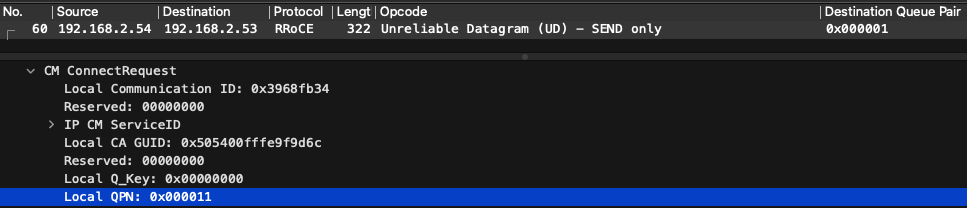
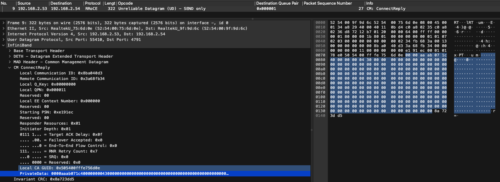
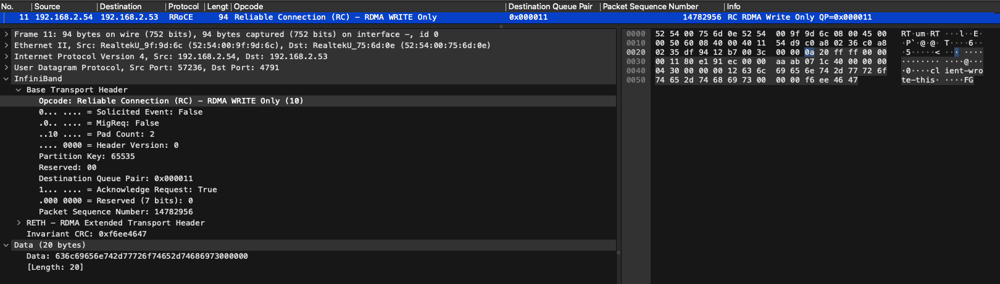
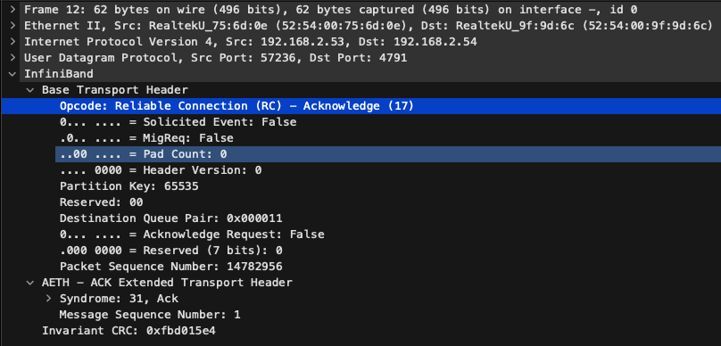
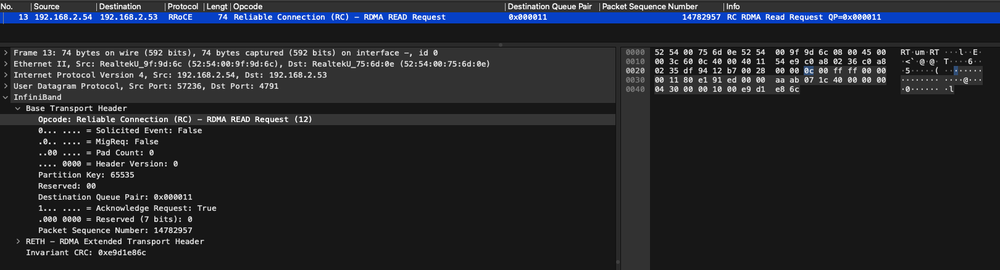
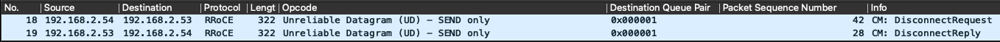

# Minimal RDMA sample (tutorial-friendly)

This folder contains the smallest runnable client/server pair in the repo. It is
designed for blog walk-throughs where you want to show the full RDMA flow without
the extra diagnostics used in the main samples.

## What it demonstrates
- RDMA CM as the control plane: resolve, connect, exchange a tiny blob of metadata.
- One-sided data plane: RDMA WRITE then RDMA READ to the same remote buffer.
- Why the metadata matters: the client needs the remote address and rkey to do
  one-sided operations safely.

## Build
From the repo root:
```bash
make minimal
```

## Run
On server VM:
```bash
./rdma_min_server 7471
```
On client VM (use server IP):
```bash
./rdma_min_client <SERVER_IP> 7471
```

## Walkthrough (with capture points)

Use this as a narrated flow. Run tcpdump/Wireshark before starting the client so you capture the setup and data path.

1) **Server binds and listens**
   - Code: `examples/c/minimal/server_min.c`
   - Action: server creates CM ID and calls `rdma_listen`
   ```bash
   ubuntu@rdma-server:~/rdma-roce-lab$ ./rdma_min_server 7471
   [07:04:56.582 #0001 main] SLOW  create CM channel + listen
   [07:04:56.587 #0002 main] SLOW  wait CONNECT_REQUEST   
   ```

2) **Client resolves address and route**
   - Code: `examples/c/minimal/client_min.c`
   - Action: `rdma_resolve_addr` and `rdma_resolve_route`
   ```bash
   ubuntu@rdma-client:~/rdma-roce-lab$ ./rdma_min_client 192.168.2.53 7471
   [07:03:13.196 #0001 main] SLOW  create CM channel + ID
   [07:03:13.200 #0002 main] SLOW  resolve 192.168.2.53:7471
   [07:03:13.200 #0003 cm_client_resolve] INFO  cm: getaddrinfo(192.168.2.53:7471)
   [07:03:13.200 #0004 cm_client_resolve] INFO  cm: rdma_resolve_addr(timeout=5000ms)
   [07:03:13.200 #0005 cm_client_resolve] INFO  cm: waiting ADDR_RESOLVED
   [07:03:13.201 #0006 cm_client_resolve] INFO  cm: rdma_resolve_route(timeout=5000ms)
   [07:03:13.201 #0007 cm_client_resolve] INFO  cm: waiting ROUTE_RESOLVED
   ```

3) **Objects are created (PD/CQ/QP)**
   - Code: `src/rdma_builders.c`
   - Action: PD, CQ, QP creation on both sides
   ```bash
   [07:10:26.617 #0008 main] SLOW  build PD/CQ/QP
   [07:10:26.618 #0009 dump_qp] INFO  QP dump: qpn=17 state=INIT mtu=1 sq_psn=0 rq_psn=0 max_rd_atomic=0 max_dest_rd_atomic=0 retry=0 rnr_retry=0 timeout=0
   [07:10:26.618 #0010 dump_qp] INFO  QP caps: max_send_wr=63 max_recv_wr=63 max_sge={s=1,r=1}
   [07:10:26.618 #0011 main] SLOW  rdma_connect
   ```

4) **Connection is established**
   - Code: `src/rdma_cm_helpers.c`
   - Action: client calls `rdma_connect`, server accepts, both reach ESTABLISHED

   ```bash
   [07:10:26.618 #0012 cm_client_connect_only] INFO  cm: rdma_connect()
   [07:10:26.619 #0013 cm_client_connect_only] INFO  cm: rdma_connect() returned   
   ```
  
   

5) **Private data exchange**
   - Code: `examples/c/minimal/server_min.c` (pack) / `client_min.c` (unpack)
   - Action: server sends `{addr, rkey}` via CM private_data
   ```bash
   [07:10:26.607 #0006 main] SLOW  register remote MR (READ/WRITE)
   [07:10:26.607 #0007 main] SLOW  accept and share addr/rkey
   [07:10:26.607 #0008 main] SLOW    addr=0xaaaaf5121000
   [07:10:26.607 #0009 main] SLOW    rkey=0x43b
   [07:10:26.608 #0010 main] SLOW  wait ESTABLISHED
   [07:10:26.699 #0011 main] FAST  wait for client RDMA WRITE/READ
   ```
   


6) **RDMA WRITE (one-sided)**
   - Code: `examples/c/minimal/client_min.c`
   - Action: client writes into remote buffer (no server CPU on data path)
   ```bash
   [07:10:26.685 #0015 main] SLOW  read private_data (remote addr/rkey)
   [07:10:26.685 #0016 main] SLOW  remote addr=0xaaaaf5121000
   [07:10:26.685 #0017 main] SLOW  remote rkey=0x43b
   [07:10:26.685 #0018 main] FAST  register local TX/RX
   [07:10:26.685 #0019 main] DATA  post RDMA_WRITE len=18
   [07:10:26.685 #0020 dump_sge] INFO  SGE(WRITE): addr=0xaaaac32b7000 len=18 lkey=0x79b
   [07:10:26.685 #0021 dump_wr_rdma] INFO  WR: wr_id=1 opcode=RDMA_WRITE signaled=1 num_sge=1 remote_addr=0xaaaaf5121000 rkey=0x43b
   ```
   
   Since this is an RC connection, the server ACKs the write. 

   

   Then we poll the CQ: 
   ```bash
   [07:10:26.685 #0022 main] DATA  poll RDMA_WRITE
   [07:10:26.775 #0023 dump_wc] INFO  WC: wr_id=1 status=0 opcode=RDMA_WRITE byte_len=18 qp_num=17
   ```

7) **RDMA READ (one-sided)**
   - Code: `examples/c/minimal/client_min.c`
   - Action: client reads back for verification
   ```bash
   [07:10:26.776 #0024 main] DATA  post RDMA_READ len=4096
   [07:10:26.776 #0025 dump_sge] INFO  SGE(READ): addr=0xaaaac32b9000 len=4096 lkey=0x814
   [07:10:26.776 #0026 dump_wr_rdma] INFO  WR: wr_id=2 opcode=RDMA_READ signaled=1 num_sge=1 remote_addr=0xaaaaf5121000 rkey=0x43b
   ```
   

8) **Completions (CQE)**
   - Code: `src/rdma_ops.c`
   - Action: client polls CQ for completions
   ```bash
   [07:10:26.776 #0027 main] DATA  poll RDMA_READ
   [07:10:26.814 #0028 dump_wc] INFO  WC: wr_id=2 status=0 opcode=RDMA_READ byte_len=4096 qp_num=17
   [07:10:26.814 #0029 main] DATA  readback 'client-wrote-this'
   Client read back: 'client-wrote-this'
   ```

9) **Disconnect**
   - Action: client disconnects, server cleans up
   

Capture tips: see `docs/on-the-wire.md` for tcpdump/Wireshark commands and filters.
QP lifecycle walkthrough: see `docs/qp-state-walkthrough.md` for step-by-step state progression.

## Where to look in code
- Server: `examples/c/minimal/server_min.c`
- Client: `examples/c/minimal/client_min.c`

## Real-world anchor: parameter server
Treat the server buffer as a "weights" region. The client WRITEs gradients and
READs back updated weights. The flow is identical; only the payload changes.

## Wireshark captures
- [on-the-wire](/docs/on-the-wire.md)
